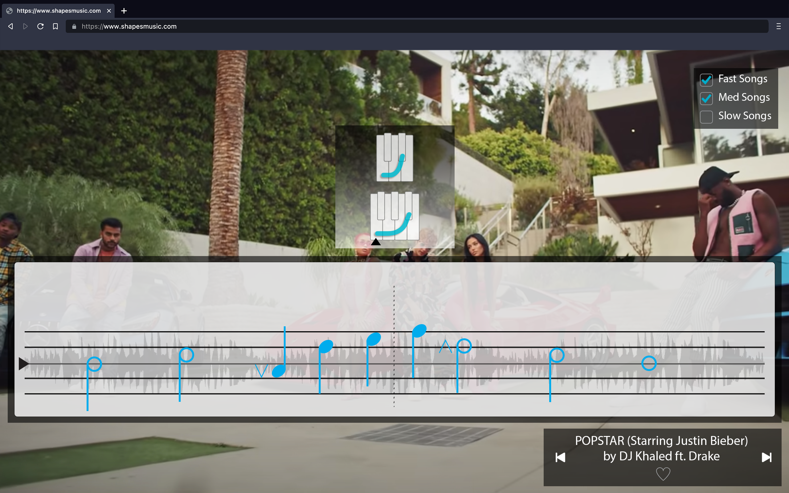

# Shapes

_A Music Method for the Expert Beginner_

### Overview

This is a work in progress.  
Check out the full [Table of Contents](contents.md)  
And [notes](notes.md) on each section

### Shapes Basics Series

#### [Lesson 1 - A Shape](https://shapesmusic.github.io/shapes-method/lessons/01-a-shape.html)

Use a single shape to play along with a playlist of songs. Hear when notes fit or don't fit, and start to follow your musical intuition.

#### [Lesson 2 - Different Shapes](https://shapesmusic.github.io/shapes-method/lessons/02-different-shapes.html)

Add some different shapes and continue playing along with songs.

#### [Lesson 3 - A Group of Shapes](https://shapesmusic.github.io/shapes-method/lessons/03-a-group.html)

See the shapes as a group, and add a way to name the shapes.

#### [Lesson 4 - Shape Fingerings](lessons/04-shape-fingerings.md)

Learn how your hands match the keyboard, and how to play hands together in any shape, beginning on any note, using only one fingering pattern.

#### [Lesson 5 - The Anchor Note](lessons/05-the-anchor-note.md)

Hear the one note all the others are pulling toward.

#### [Lesson 6 - Playing With the Anchor](lessons/06-playing-with-the-anchor.md)

Use the anchor note to come up with some ideas for playing.

#### [Lesson 7 - Bass Notes](lessons/07-bass-notes.md)

Hear the notes that give structure to a song.

#### [Lesson 8 - Matching A Shape](lessons/08-matching-a-shape.md)

Learn to match a shape with a song on your own.

#### [Lesson 9 - Notes in Time](lessons/09-notes-in-time.md)

Learn to represent bass notes using music notation.

#### [Lesson 10 - Changes](lessons/10-changes.md)

Play with changing bass notes, anchors, *and* shapes.

#### [Lesson 11 - Groups of Shapes](lessons/11-groups-of-shapes.md)

Get to know three additional groups of shapes.

#### [Lesson 12 - Reading by Touch](lessons/12-reading-by-touch.md)

Begin to sight read music notation at the keyboard.

#### [Lesson 13 - A Tonescape and Tensions](lessons/13-a-tonescape-and-tensions.md)

Begin to recognize the sounds of individual notes in a tonescape.

#### [Lesson 14 - Imagination as an Instrument](lessons/14-imagination-as-an-instrument.md)

Begin to draw individual notes out of the tonescape.

#### Lesson 15 - Tensions Part 2

Add two more notes to recognize in a tonescape.

#### [Lesson 16 - Reading by Ear](lessons/16-reading-by-ear.md)

Use notation, and add two additional notes to draw out of the tonescape.

#### [Lesson 17 - Switch To Number Names](/lessons/17-switch-to-number-names.md)

Begin to hear notes in any octave as tensions to the anchor.

#### Lesson 18 - Reading by Touch Part 2

Incorporate two additional shapes into your reading at the keyboard.

#### [Lesson 19 - Moods](lessons/19-moods.md)

Begin to recognize the different feelings of different tonescapes.

#### Lesson 20 - Reading by Ear Part 2

Draw notes out of two additional tonescapes.

#### Lesson 21 - Light & Heavy Tensions

Listen to the tensions that make one mood feel different from another.

#### [Lesson 22 - Independent Solfege](lessons/22-independent-solfege.md)

Learn to name a note without having to reference any other note.

#### [Lesson 23 - Reading by Touch Part 3](lessons/23-reading-by-touch-3.md)

Sight read all tensions and two additional shapes at the keyboard.

#### [Lesson 24 - Moods and Tensions Together](lessons/24-moods-and-tensions-together.md)

Add the remaining tensions in three moods.

#### [Lesson 25 - Getting Inside of Moods](lessons/25-getting-inside-of-moods.md)

Add two additional moods along with their tensions.

#### Lesson 26 - Reading by Ear Part 3

Draw all the tensions out of the tonescape, and add two additional moods.

#### Lesson 27 - Incidentals

Learn how to notate tensions outside of the shape.

#### Lesson 28 - Making Time Relative

Add rhythmic note values to your reading at the keyboard.

#### Lesson 29 - Reading by Touch Part 4

Incorporate two additional shapes into your reading at the keyboard.

#### [Lesson 30 - All Moods and Tensions](lessons/30-all-moods-and-tensions.md)

Add two remaining moods along with their tensions.

#### Lesson 31 - Reading by Ear Part 4

Draw all the tensions out of all moods.

#### Lesson 32 - Mood Names

Learn the standard names for the moods.

#### Lesson 33 - Reading by Touch Part 5

Incorporate all the shapes into your reading at the keyboard.

#### Lesson 34 - Holding on to the Anchor

Recognize all the tensions without a tonescape.

#### Lesson 35 - Imagination as an Instrument Part 2

Recognize any mood and free play inside it.
